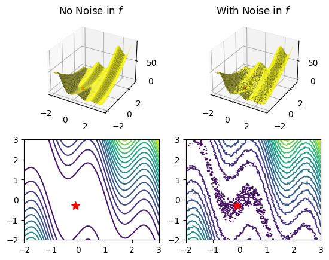

# Trust Region Method for Noisy Functions: A Review

[Sun and Nocedal](https://arxiv.org/abs/2201.00973) have recently proposed a trust region method to solve optimization problems involving noisy functions. In this paper, we present numerical results illustrating the performance of this new algorithm compared to the naive trust region method as well as the [BFGS with Errors method](https://arxiv.org/abs/1901.09063), an algorithm commonly used for noisy function optimization. We discovered that the new algorithm performs superior to the other two methods when there is noise only in the objective function and that all three approaches fail to converge to the unconstrained minimum when there is noise in the gradient.

  

